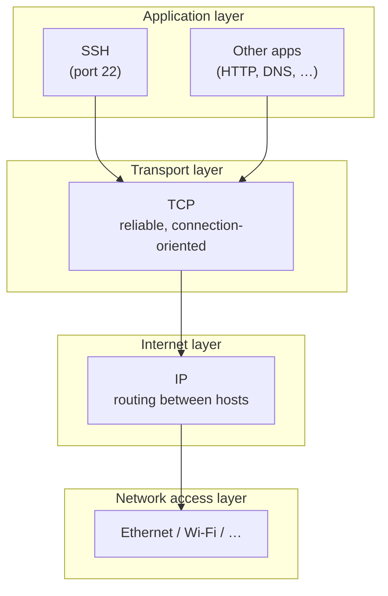

# SSH and the TCP/IP Model

Short reference on **SSH (Secure Shell)** — what it is, how it works, and where it sits in the network stack.

## What is SSH?

SSH is an **application-layer protocol** for secure remote access over an untrusted network. It replaces older tools like Telnet and rlogin, which sent credentials and data in plain text.

Typical uses:

- Remote shell (`ssh user@host`)
- File transfer (`scp`, `sftp`)
- Port forwarding / tunneling
- Git over SSH, CI/CD, server administration

Default port: **22** (TCP).

## TCP/IP model — where SSH lives

SSH runs at the **Application** layer. It does not replace TCP or IP; it uses them for delivery.

| Layer        | Role                          | SSH example                          |
| ------------ | ----------------------------- | ------------------------------------ |
| Application  | End-user services & protocols | **SSH** (session, auth, encryption)  |
| Transport    | Reliable end-to-end delivery  | **TCP** (port 22, connection-oriented) |
| Internet     | Host-to-host routing          | **IP** (IPv4 / IPv6)                 |
| Network access | Frames on the physical link | Ethernet, Wi‑Fi, etc.                |

### Stack diagram



### Data path (simplified)

```
[ SSH client ]  encrypts shell / file / tunnel data
       ↓
[ TCP ]         segments stream, guarantees delivery (port 22)
       ↓
[ IP ]          adds source/destination addresses, routes packets
       ↓
[ Link ]        puts frames on the wire
       ↓
     (reverse on the server)
```

## How an SSH session works

1. **TCP handshake** — Client opens a TCP connection to the server (usually port 22).
2. **SSH version exchange** — Both sides agree on protocol version.
3. **Key exchange & algorithms** — Negotiate encryption, integrity (MAC), and compression.
4. **Server authentication** — Client verifies the server (host key / known_hosts).
5. **User authentication** — Password, public key, or other method.
6. **Encrypted channel** — Shell, SFTP, SCP, and port forwards run inside the secure tunnel.

## SSH vs OSI (quick map)

| TCP/IP layer   | OSI layers (approx.) | SSH-related piece        |
| -------------- | -------------------- | ------------------------ |
| Application    | 7, 6, 5              | SSH protocol & services  |
| Transport      | 4                    | TCP                      |
| Internet       | 3                    | IP                       |
| Network access | 2, 1                 | Physical / data link     |

SSH itself handles presentation and session concerns (encryption, authentication) at the application layer rather than as separate OSI layers.

## Related protocols (same layer)

| Protocol | Port (typical) | Encrypted? | Notes                    |
| -------- | -------------- | ---------- | ------------------------ |
| SSH      | 22             | Yes        | Remote access, SFTP/SCP  |
| Telnet   | 23             | No         | Legacy; avoid in production |
| HTTPS    | 443            | Yes        | Web over TLS             |
| FTP      | 21             | No         | Plain file transfer      |

## One-line summary

**SSH is an encrypted application protocol that runs over TCP/IP** — TCP provides reliable transport, IP provides routing, and SSH adds authentication and confidentiality on top.
